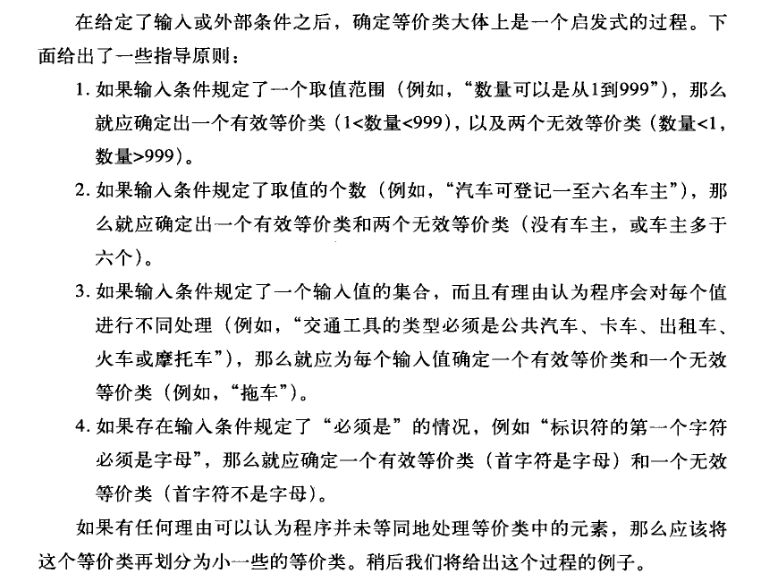
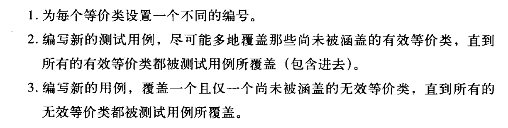
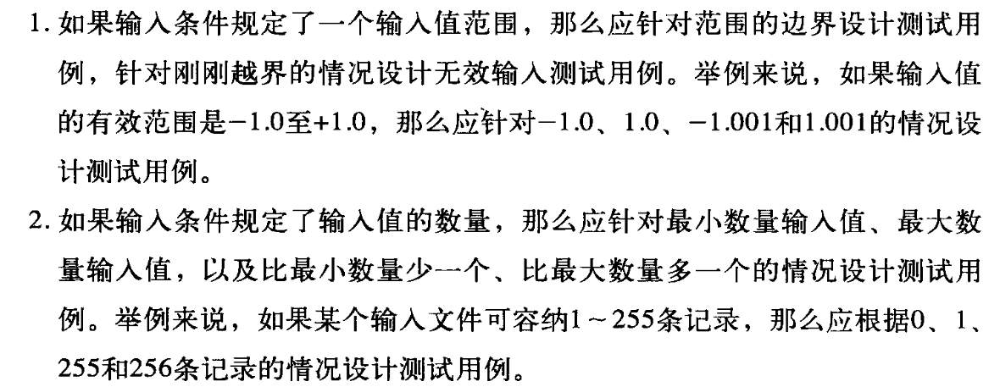
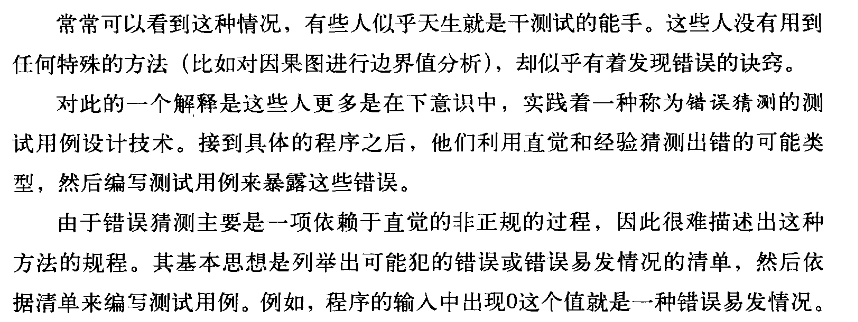
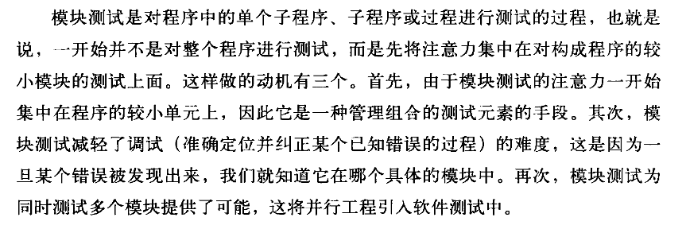
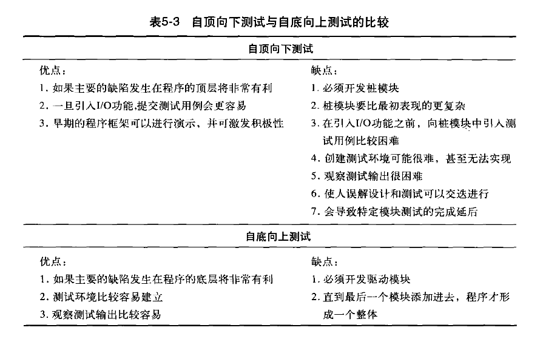
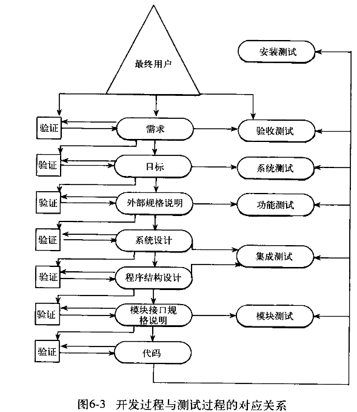
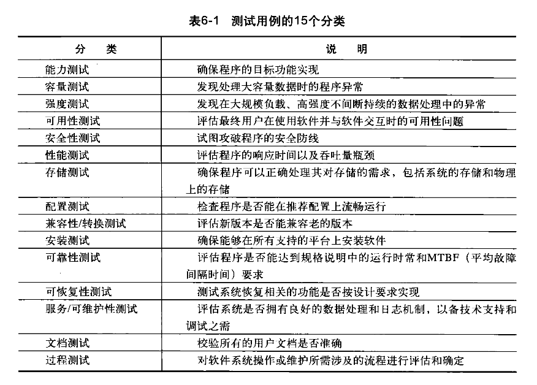

# 测试理论

### 什么是软件测试？

**答：软件测试是在规定的条件下对程序进行操作，以发现错误，对软件质量进行评估。**

### 软件测试的目的

**答：软件测试的目的在于（1）**  **发现软件的缺陷和错误**  **（2）**  **保证软件的质量**  **，**  **确保能够满足用户以及产品的需求**  **。**

 **（标重点）**  **软件测试的目的是为了找bug，并不是验证软件没有bug**  **。**

### 软件测试的原则

 **（1）测试用例中的一个必需部分是对预期输出或结果的定义**

 **（2）程序员应当避免测试自己编写的程序**

 **（3）测试用例的编写不仅应当根据有效或预期的输入情况，而且也应当根据无效或未预料到的输入情况。**

 **（4）检查程序是否未做其应该做的仅是测试的一半，测试的另一半是检查程序是否做了其不应该做的。**

 **（5）测试是为了发现错误而执行程序的过程，而不是为了证明程序正确运行的过程。**

### 什么是白盒测试

**宝盒测试又称为逻辑驱动的测试，允许我们检查程序的内部结构。这种测试策略对程序的逻辑结构进行检查，从中获取测试数据。**

### 白盒测试常用方法

**答：**

**静态测试：不用运行程序的测试，如文档测试、代码检查等**

**动态测试：需要执行代码，接口测试、覆盖率分析、性能分析、内存分析等。**

 **逻辑覆盖法**  **：主要包括****语句覆盖，判断覆盖，条件覆盖，判断/条件覆盖，条件组合覆盖，路径覆盖**等。

**六种覆盖标准发现错误的能力由弱到强的变化：**

1. **语句覆盖**  **，每条语句至少执行一次。**
2. **判断覆盖，每个判断的每个分支至少执行一次。**
3. **条件覆盖，每个判段的每个条件应取到的各种可能的值。**
4. **判断/条件覆盖，同时满足判断覆盖条件覆盖。**
5. **条件组合覆盖，每个判定中各条件的每一种组合至少出现一次。**
6. **路径覆盖**  **，使程序中每一条可能的路径至少执行一次。**

### 什么是黑盒测试？

**黑盒测试又称为数据驱动的测试或输入输出驱动的测试。使用这种测试时，将程序视为一个黑盒子。测试目标与程序的内部机制和结构完全无关，而是将重点集中放在发现程序不按其规范正确运行的环境条件。**

### 黑盒测试常用方法

**答：**  **等价类划分，边界值分析，错误推测法**  **、****因果图法**等。

#### （1）等价类划分

**等价类划分法是指依据需求对输入的范围进行分类，然后在分出的每一个区域内选取一个有代表性的测试数据开展测试。**

* **确定等价类**  **：确定等价类是选取每一个输入条件并将其划分为两个或更多的组。可以划分为有效等价类和无效等价类。有效等价类代表对程序的有效输入。而无效等价类代表的是不正确的输入值。**

​

* **生成测试用例：**  **第二步是使用等价类来生成测试用例，其过程如下：**

​

#### （2）边界值分析

**所谓边界条件，是指输入和输出等价类中那些恰好处于边界、或超过边界、或在边界以下的状态。**

**边界值分析方法与等价划分方法存在两方面的不同：**

* **与从等价类中挑选出任意一个元素作为代表不同，边界值分析需要选择一个或多个元素，以便等价类的每个边界都经过一次测试。**
* **与仅仅关注输入条件不同，还需要考虑从结果空间设计测试用例。**

​

#### （3）错误猜测

​

### 什么是灰盒测试？

**答：灰盒测试，是介于**​[白盒测试](https://baike.baidu.com/item/%E7%99%BD%E7%9B%92%E6%B5%8B%E8%AF%95/934440)与[黑盒测试](https://baike.baidu.com/item/%E9%BB%91%E7%9B%92%E6%B5%8B%E8%AF%95/934030)之间的一种测试，灰盒测试多用于[集成测试](https://baike.baidu.com/item/%E9%9B%86%E6%88%90%E6%B5%8B%E8%AF%95/1924552)阶段。目前互联网的测试大多数都是灰盒测试。

### 什么是单元测试

​

### 单元测试用例设计

* **在为模块测试设计的测试用例时，需要使用两种类型的信息：模块的规格说明和模块的源代码。规格说明一般都规定了模块的输入和输出参数以及模块的功能。**
* **模块测试（单元测试）总体上是面向白盒测试的。模块测试中测试用例的设计过程：使用一种或多种白盒测试方法分析模块的逻辑结构，然后使用黑盒测试方法对照模块的规格说明以补充测试用例。**

### 增量测试与非增量测试

* **非增量测试：软件测试应先独立地测试每个模块，然后再将这些模块组装成完整的程序。**
* **增量测试：将下一步要测试的模块组装到测试完成的模块集合中，然后再进行测试。****两种增量测试（自顶向下的测试和自底向上的测试）。**

​

### 集成测试和系统测试的对比

**区别：**

* **执行顺序：先执行集成测试，待集成测试问题修复后，再做系统测试。**
* **用例粒度：集成测试比系统测试用例更详细，集成测试对于接口部分也要重点写，而系统测试的用例更接近用户接受的测试用例。**

**应用场景：**

* **集成测试：一般包含接口测试，对程序的提测部分进行测试。测试方法一般选用黑盒测试和白盒测试相结合。**
* **系统测试：针对整个产品的全面测试，既包含各模块的验证性测试和功能性测试，又包含对整个产品的健壮性、安全性、可维护性及各种性能参数的测试。测试方法一般采用黑盒测试法。**

### 测试开发需要哪些知识？

**需要的知识：**

* **软件测试基础理论知识**  **，如黑盒测试、白盒测试等；**
* **编程语言基础**  **，如C/C++、java、python等；**
* **自动化测试工具**  **，如Selenium、Appium等；**
* **计算机基础知识**  **，如数据库、Linux、计算机网络等；**
* **测试卡框架**  **，如JUnit、Pytest、Unittest等。**

### 手动测试与自动化测试的优缺点

**答：**

**手工测试缺点：**

1. **重复的手工回归测试，代价昂贵、容易出错。**
2. **依赖于软件测试人员的能力。**

**手工测试的优点：**

1. **测试人员具有经验和对错误的猜测能力。**
2. **测试人员具有审美能力和心理体验。**
3. **测试人员具有是非判断和逻辑推理能力。**

**自动化测试的缺点：**

1. **不能取代手工测试。**
2. **无法运用在测试复杂的场景**
3. **手工测试比自动化测试发现的缺陷更多。**
4. **对测试质量的依赖性极大。**
5. **自动化测试不能提高有效性。**
6. **比手动测试脆弱，需要维护成本。**
7. **工具本身并无想象力。**

**自动化测试的优点：**

1. **对程序的回归测试更方便。**
2. **可以运行更多更繁琐的测试。**
3. **可以执行一些手工测试困难或不可能进行的测试。**
4. **更好地利用资源。**
5. **测试具有一致性和可重复性。**
6. **测试的复用性。**
7. **增加软件的信任度。**

### 自动化测试的运用场景举例

1. **线上巡检（UI+接口）**
2. **简单场景监控**
3. **稳定性测试（monkey+遍历测试）**

### 开发过程与测试过程的对应关系

​

### 什么是功能测试

**功能测试是一个试图发现程序与外部规格说明之间存在不一致的过程。外部规格说明是一份从最终用户的角度对程序行为的精确描述。**

### 什么是系统测试

**系统测试并非是测试整个系统或者程序功能的过程，因为有了功能测试，这样会显得多余。系统测试并不局限于系统。如果产品是一个程序，那么系统测试就是试图说明程序作为一个整体是如何不满足其目标的过程。**

​

### 什么是验收测试

**验收测试是将程序与其最初的需求及最终用户当前的需要进行比较的过程。该测试通常是由程序的客户或最终用户来进行。**

### 什么是压力测试？

**        压力测试是在高负载情况下，对系统稳定性进行测试。在高负载的情况下，系统出现异常的概率要比正常负载时要高。高负载包含长时间运行、大数据、高并发等情况。**

**        在做压力测试时，一般要考虑环境因素、性能指标、运行时间等要素。**

**压测环境最好和生产环境一致，假如要在生产环境进行压测，需要在凌晨等在线用户量极少的情况下进行。在生产环境测试时要做好数据隔离，生产环境需提供虚拟数据，采用虚拟账号，避免对真实线上用户造成影响。**

**         性能指标包括，内存、CPU、TPS、QPS、网络流量、错误统计等，这些指标需要监控。**

**压测一般需要运行长时间，最好能够通过长时间的压测，绘制出曲线图，这样更容易观察到性能瓶颈。**

### 怎么实施自动化测试

**答：**

1. **首先判断项目适不适合进行自动化测试。**
2. **对项目做需求分析。**
3. **制定测试计划和测试方案。**
4. **搭建自动化测试框架。**
5. **设计或编写测试用例。**
6. **执行自动化测试。**
7. **评估。**

### 测试项目具体工作是什么

**答：**

1. **搭建测试环境**
2. **撰写测试用例**
3. **执行测试用例**
4. **写测试计划、测试报告**
5. **测试并提交BUG**
6. **跟踪BUG修改情况**
7. **自动化测试**
8. **性能测试、压力测试、安全测试等其他测试**

### BUG分级

**答：两个维度去划分**

1. **按BUG严重程度划分等级： **

* **blocker：系统无法执行，崩溃，或严重资源不足，应用模块无法启动或异常退出，无法测试，系统不稳定。常见的：严重花屏、内存泄漏、用户数据丢失或破坏、系统崩溃/死机/冻结、模块无法启动或异常退出、严重的数值计算错误、功能设计与需求严重不符、服务器500等。**
* **critical：影响系统功能或操作，主要功能存在严重缺陷，但不会影响到系统的稳定性。常见的有：功能未实现，功能错误、系统刷新错误、数据通讯错误、轻微的数值计算错误、影响功能及洁面的错别字或拼写错误。**
* **major：界面、性能缺陷、兼容性。常见的有：操作界面错误、边界条件错误、提示信息错误，长时间操作无法提示、系统未优化、兼容性问题。**
* **minor/trivial：易用性及建议性的问题。**

2. **按BUG处理优先级划分： **

* **immediate：马上解决**
* **urgent：急需解决**
* **high：高度重视，有时间马上解决**
* **low：在系统发布前解决或确认可以不用解决**

### APP性能指标有哪些？

**答：内存、CPU、流量、电量、启动速度、滑动速度、界面切换速度、与服务器交互的网络速度。**

### APP测试工具有哪些？

**接口测试：postman**

**性能测试：jmeter**

**抓包工具：chales、fiddler**

**UI自动化：uiautomator2、appium、atx**

**稳定性测试：monkey、maxim、uicrawler、appcrawler**

**兼容性测试：wetest、testin**

**内存、cpu、电量测试：GT、soloPi**

**弱网测试：chales**

### BUG的生命周期

**答：**

**复杂版：**

1. **New（新的）**
2. **Assigned（已指派）**
3. **Open（打开的）**
4. **Fixed（已修复）**
5. **Pending Reset（待测试）**
6. **Reset（再测试）**
7. **Closed（已关闭）**
8. **Reopen（再次打开）**
9. **Pending Reject（拒绝中）**
10. **Rejected（被拒绝的）**
11. **Postponed（延期）**

**简单版：**

1. **创建bug**
2. **分配bug**
3. **修复完待测试**
4. **关闭**
5. **重新开启**
6. **无效**

### 什么是α测试和β 测试？

**答：**

**α测试：在受控的环境下进行，由用户在开发着的场所进行，开发者指导用户测试，开发者负责记录发现的错误和使用中遇到的问题。**

**β 测试：在开发者不可控的环境下进行，由软件最终用户在一个或多个客户场所下进行，用户记录测试中遇到的问题，并定期上报给开发者。**

### 对敏捷开发的理解

**提到敏捷，不得不联想到瀑布开发，瀑布开发按项目为核心，一般都会有一个相对较长的项目周期，一开始把项目设计得大而全，完成项目并交付后，工作重心就会转移到另一个项目去。而敏捷开发是以需求为核心，一开始不会把产品设计得大而全，而是通过快速迭代的方式，不断采集需求，不断更新迭代。敏捷开发的开发周期更短，能够快速试错，快速迭代，敏捷开发比瀑布开发更顺应目前的软件开发趋势。**

**敏捷开发也对应着有敏捷测试，测试环节贯穿整个迭代周期，从需求评审到发布上线，都离不开测试快速跟进。测试左移：需求评审、用例设计、自测工具、静态代码扫描等；测试中：业务测试，接口测试，性能测试等；测试右移：稳定性测试，回归测试，灰度测试等。**

‍
